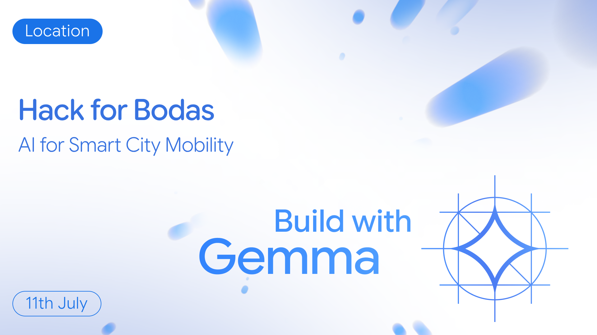

# Twogele Boda 🛵

**Twogele Boda** is a unified, natively multimodal AI assistant built for Kampala's boda boda mobility ecosystem. Powered by **Gemma 4**, the platform gives riders a single conversational gateway for critical road-safety reporting and daily business bookkeeping.

This repository houses the full stack: a **FastAPI** backend driven by Gemma 4, with a frontend for the rider experience.

---

## Build with Gemma Hackathon

Built for **[Build with Gemma](https://ai.google.dev/gemma)** — *Hack for Bodas: AI for Smart City Mobility* (11th July).



**Twogele Boda** applies Gemma 4 to a real Kampala mobility problem: busy boda riders should not juggle separate apps for safety dispatch and livelihood tracking. One chat handles both — in English, Luganda, or street slang, via text or audio.

| Hackathon focus | How Twogele Boda uses Gemma 4 |
|-----------------|-------------------------------|
| Smart city mobility | Incident triage for Kampala roads & stages |
| Local language / slang | Native understanding of Luganda + Kampala slang |
| Structured agent output | SAFETY reports + EXPENSE JSON ledger payloads |
| Multimodal input | Text and audio through one assistant |

---

## The Core Innovation: 2-in-1 Integration

Asking a busy rider to switch platforms while navigating Kampala is unrealistic. Twogele Boda merges safety dispatching and personal finance logging into one interface.

Pipeline:

1. **Deep reasoning (`<|think|>` tokens)** — Gemma 4 unpacks local slang (*mwana*, *panya*, *kaveera*, *stage*), translates Luganda → English, and classifies intent as **SAFETY** or **EXPENSE**.
2. **Context-specific output** — structured hazard fields for incidents, or production-ready JSON for the ledger.

---

## Feature Tracks

### Track 1: Safer Rides (Incident Reporter)

When a hazard, road block, or collision is reported, the agent translates mixed-language input into professional English and extracts:

- **Hazard Type**
- **Location** (landmark, stage, or road)
- **Urgency** (`LOW` | `MEDIUM` | `HIGH` | `CRITICAL`)
- **Responsible Body**

Routing examples:

- **KCCA** — potholes, drainage, broken infrastructure
- **Uganda Traffic Police / Emergency Medical Response** — collisions, slippery hazards, medical emergencies

### Track 2: Boda Livelihoods (Smart Bookkeeping)

When income, expenses, or savings are logged, the assistant returns clean ledger JSON (interpreting shortcuts like `20k` → `20000`) and can suggest practical investment options for monthly savings:

```json
{
  "Fuel expenses": 25000,
  "Daily expenses": null,
  "Income saved": 40000
}
```

---

## Project Structure

```text
twogele-boda/
├── hackathonbanner.png          # Build with Gemma / Hack for Bodas banner
├── README.md                    # This file
├── twogele-boda-backend/        # FastAPI + Gemma 4 agent
│   ├── server.py                # API entrypoint & CORS
│   ├── agent/
│   │   ├── twogele_prompt.py    # System prompt (SAFETY + EXPENSE)
│   │   └── model_engine.py      # Google AI Studio SDK
│   ├── tests/                   # Live prompt test cases
│   └── README.md                # Backend setup guide
└── twogele-boda-frontend/       # Rider UI (coming next)
```

---

## Quick Start (Backend)

```bash
cd twogele-boda-backend
python3 -m venv .venv
source .venv/bin/activate
pip install -r requirements.txt
cp .env.example .env   # add GEMINI_API_KEY from https://aistudio.google.com/apikey
python server.py       # http://localhost:8000
```

Full backend docs, API examples, and prompt tests: **[twogele-boda-backend/README.md](./twogele-boda-backend/README.md)**

---

## Quick Start (Frontend)

```bash
cd twogele-boda-frontend
cp .env.example .env   # VITE_API_URL + VITE_NEON_AUTH_URL
npm install
npm run dev            # http://localhost:5173
```

**Live app:** [https://twogele-boda.vercel.app/](https://twogele-boda.vercel.app/) — deploy notes in **[twogele-boda-frontend/VERCEL.md](./twogele-boda-frontend/VERCEL.md)**. On Render, keep `https://twogele-boda.vercel.app` in `CORS_ORIGINS`, and allow that origin in Neon Auth.

---

## Tech Stack

| Layer | Tech |
|-------|------|
| Model | Gemma 4 (`gemma-4-26b-a4b-it`) via Google AI Studio |
| Backend | FastAPI, SQLAlchemy, Neon Postgres, google-genai |
| Frontend | React + Vite (Vercel) |

---

## License

See [LICENSE](./LICENSE).
